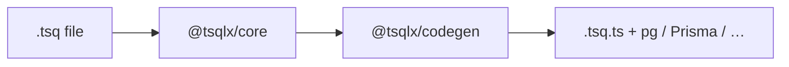

# TSQL-X (tsqlx)

Typed SQL as a file format: **`.tsq`** compiles to **TypeScript** (`.tsq.ts`) with parameterized queries for PostgreSQL and other drivers—no string concat for optional `WHERE` clauses, `[IF param] … [/IF]` is type-checked.



> **Demo in the browser:** after `pnpm run build`, run `pnpm playground` and edit `.tsq` with live output (Vite + Monaco in `apps/playground`). To re-record the README GIF: `pnpm run build && pnpm record:playground-gif` (needs `ffmpeg` and `pnpm exec playwright install chromium`).

## Why TSQL-X

- **Not a database client** — it is a compiler. You get modules that call your existing `pg.Pool` (or other targets) with correct `$1`, `$2` binding.
- **Analyzer diagnostics** — undeclared `{slots}`, bad `[IF]` on required params, and more (for example `A010`, `A011`). The lexer and parser use **error recovery** (multiple diagnostics such as `L001`–`L003` and `P001`–`P005` with a best-effort partial AST) so the analyzer and [language server](packages/language-server) can still report semantic issues after an earlier syntax problem. `compile()` does not throw for common user-facing lex/parse issues.
- **Tooling** — [VS Code extension](extensions/vscode-tsqlx), [`@tsqlx/vite`](packages/vite) for HMR on `.tsq`, and [Postgres integration tests](packages/integration-tests) that run generated code against a real database.

## Documentation

- **[Architecture](docs/architecture.md)** — compiler pipeline, package roles, and recovery behavior.
- **[Diagnostics](docs/diagnostics.md)** — tables for lexer (`L*`), parser (`P*`), analyzer (`A*`), and codegen (`C*`) codes.

## Install (npm)

Packages are published on npm under the [`@tsqlx` scope](https://www.npmjs.com/search?q=scope%3Atsqlx):

```bash
pnpm add @tsqlx/core @tsqlx/codegen
pnpm add -D @tsqlx/cli
```

The CLI binary is `tsqlx` (e.g. `pnpm exec tsqlx` or, once published, `npx tsqlx`).

## Packages

| Package | Description |
|--------|-------------|
| [`@tsqlx/core`](packages/core) | Lexer, parser, AST, analyzer, `compile()` |
| [`@tsqlx/codegen`](packages/codegen) | Emits `.tsq.ts` from the compiled AST |
| [`@tsqlx/cli`](packages/cli) | `tsqlx compile` — glob `.tsq` files, write outputs, exit `1` on errors |
| [`@tsqlx/vite`](packages/vite) | [Vite](https://vitejs.dev) plugin: `import` from `*.tsq` with HMR |
| [`@tsqlx/language-server`](packages/language-server) | LSP (diagnostics, hovers on `{slot}`) — used by the VS Code extension |

## Try it in the browser

The playground is a static **Vite + React + Monaco** app: source `.tsq` on the left, generated TypeScript on the right, with analyzer squiggles.

```bash
pnpm install
pnpm run build
pnpm playground
```

- **Shorthand** — `pnpm playground` runs `pnpm --filter @tsqlx/playground dev` (default dev server port **5174**).
- **Production build** — `pnpm --filter @tsqlx/playground build` outputs `apps/playground/dist` (deploy to Vercel, Cloudflare Pages, GitHub Pages, etc.).

[TSQL-X playground](docs/playground.gif)

## Vite

```ts
// vite.config.ts
import { defineConfig } from "vite";
import react from "@vitejs/plugin-react";
import { tsqlx } from "@tsqlx/vite";

export default defineConfig({
  plugins: [react(), tsqlx({ target: "pg" })],
});
```

Then use project-relative imports, for example:

```ts
import { getPestReport } from "./queries/report.tsq";
```

## VS Code

The [`extensions/vscode-tsqlx`](extensions/vscode-tsqlx) extension registers the **`tsq`** language, spawns [`@tsqlx/language-server`](packages/language-server), and provides:

- **Squiggles** for semantic errors (including `A010` undeclared slot, `A011` on `[IF]`).
- **Hover** on `{slot}` names → `@input` type and optionality.

Open `extensions/vscode-tsqlx` in VS Code and press **F5** to run the extension from source. For a distributable, build then package with [`vsce`](https://github.com/microsoft/vscode-vsce).

## Develop in this monorepo

**Requirements:** Node.js 20+ and [pnpm](https://pnpm.io) 9.x.

```bash
pnpm install
pnpm run build
pnpm test
```

| Script | What it does |
|--------|----------------|
| `pnpm run lint` | [Biome](https://biomejs.dev) check (format + lint) |
| `pnpm test` | Unit tests: core, codegen, cli, language-server, vite (no Docker) |
| `pnpm run test:integration` | Build + [Testcontainers](https://testcontainers.com) Postgres e2e (`packages/integration-tests`) — **Docker** required |
| `pnpm run test:playground` | Build playground + [Playwright](https://playwright.dev) smoke (preview on **4173**; run `pnpm exec playwright install` once if needed) |
| `pnpm playground` | Local browser playground (see above) |
| `pnpm codegen` | Regenerate `apps/demo` `.tsq.ts` from `queries/**/*.tsq` |

To skip the Postgres e2e in automation, set `SKIP_PG_E2E=1` in the test environment (see integration test source).

**CI:** [`.github/workflows/ci.yml`](.github/workflows/ci.yml) runs build, unit tests, and integration tests. Tag-based npm publish is described in [`.github/workflows/publish.yml`](.github/workflows/publish.yml) (requires `NPM_TOKEN` and version bumps in each package—see [CONTRIBUTING.md](CONTRIBUTING.md)).

## CLI

From the repo (after `pnpm run build`):

```bash
pnpm --filter @tsqlx/cli exec tsqlx compile --root . --glob "queries/**/*.tsq"
```

| Option | Description |
|--------|-------------|
| `--root <dir>` | Base directory for glob (default: `.`) |
| `--glob <pattern>` | fast-glob pattern (default: `**/*.tsq`) |
| `--target` | `pg`, `prisma`, or `drizzle` — overrides each file’s effective `@driver` when set |
| `--dry-run` | Parse and analyze only; do not write files |

If any diagnostic is an **error**, the process exits with code `1`.

### Supabase and hosted Postgres

Use the **`pg` target** with your connection string (pooler or direct) and a normal `pg.Pool`. Emitting ad hoc SQL through generic Supabase RPC helpers is not a supported or secure generic pattern; this project does not promote that.

## Examples

Copy-paste **`.tsq` starters** live under [`examples/`](examples/): users, orders, paginated list with `[IF]` filters, and sessions. See [`examples/README.md`](examples/README.md) for how to use them with `tsqlx compile` or Vite. The browser playground (see **Try it in the browser** above) loads these via a built-in **Example** dropdown (default: paginated list + filters).

## Demo app (`apps/demo`)

A minimal **Hono + `pg`** app exercises generated SQL against a real database.

1. Start Postgres (host port **5433**):

   ```bash
   cd apps/demo && docker compose up -d
   ```

2. `cp .env.example .env` and adjust if needed.

3. From the **repo root:**

   ```bash
   pnpm codegen
   pnpm --filter @tsqlx/demo start
   ```

4. Example: `GET http://127.0.0.1:3000/report?companyId=acme` (optional: `speciesId`, `from`, `to`).

`prestart` runs `tsqlx compile` so `queries/*.tsq.ts` matches the `.tsq` sources.

## Security

Generated code uses **parameterized** queries. You are still responsible for not concatenating untrusted data inside `.tsq` and for not exposing arbitrary SQL execution over HTTP or RPC. Prefer generated functions and typed inputs only.

## Contributing

See [CONTRIBUTING.md](CONTRIBUTING.md).

## License

[MIT](LICENSE)
