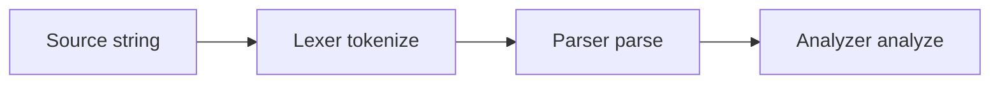

# TSQL-X compiler architecture

End-to-end flow for a `.tsq` source string:

## Packages

| Package | Role |
|---------|------|
| [@tsqlx/core](../packages/core) | Lexer → tokens; parser → `TsqFile` AST; analyzer → semantic `Diagnostic[]`. `compile()` merges lex, parse, and semantic diagnostics. |
| [@tsqlx/codegen](../packages/codegen) | `generate()` / `emitFile()` turn a `TsqFile` into TypeScript modules (pg, Prisma, raw, etc.). |
| [@tsqlx/cli](../packages/cli) | Glob files, call `generate()`, write `.tsq.ts` or exit non-zero on errors. |
| [@tsqlx/language-server](../packages/language-server) | LSP wrapper: `compile()` for diagnostics; hover uses `findSlotAtOffset` / `findParamForSlotName`. |
| [@tsqlx/vite](../packages/vite) | Vite `load` hook compiles `.tsq` imports at build time. |

## Error recovery

The lexer returns `tokens` plus **lex diagnostics** (unknown `@`, bad `{slot}`, bad `[IF`) without aborting the rest of the file. The parser returns a **partial** `TsqFile` and **parse diagnostics**, resynchronizing at the next top-level `@` directive when a construct fails. The analyzer always runs on whatever was parsed so issues like undeclared `{slot}` (`A010`) can appear on valid regions below an earlier syntax error.

## Public API entry points

- **`compile(source: string)`** — [`packages/core/src/index.ts`](../packages/core/src/index.ts)
- **`generate(source, filename, opts?)`** — [`packages/codegen/src/index.ts`](../packages/codegen/src/index.ts)
- **`tsqlx()`** (Vite plugin) — [`packages/vite/src/index.ts`](../packages/vite/src/index.ts)

## Regression corpus and benchmarks (optional)

For heavier regression testing, add `.tsq` fixtures under `packages/core` or a dedicated `corpus/` directory and run `compile()` in tests or a small script. For throughput benchmarks, time `compile()` on large generated strings in a `bench/` script (not wired to CI by default).
